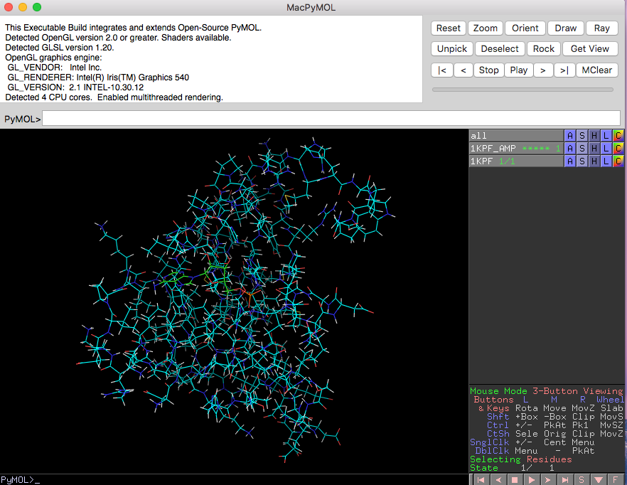
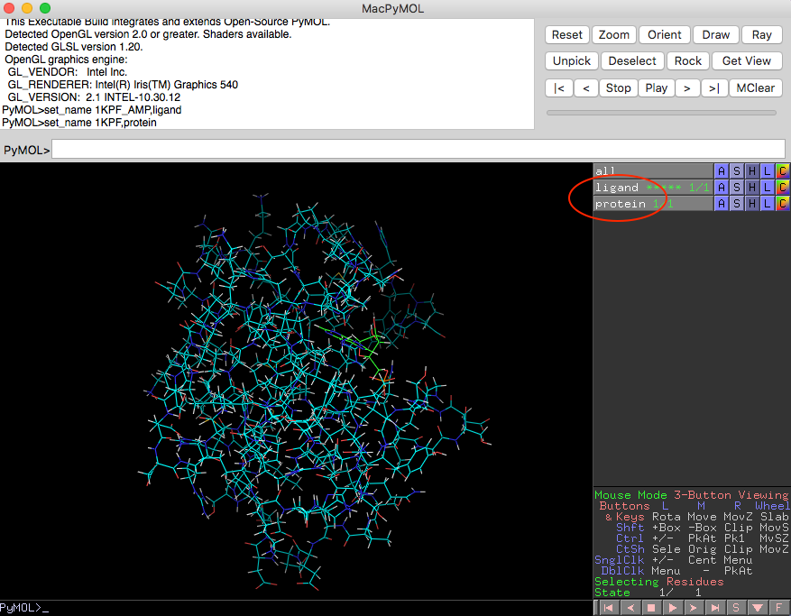
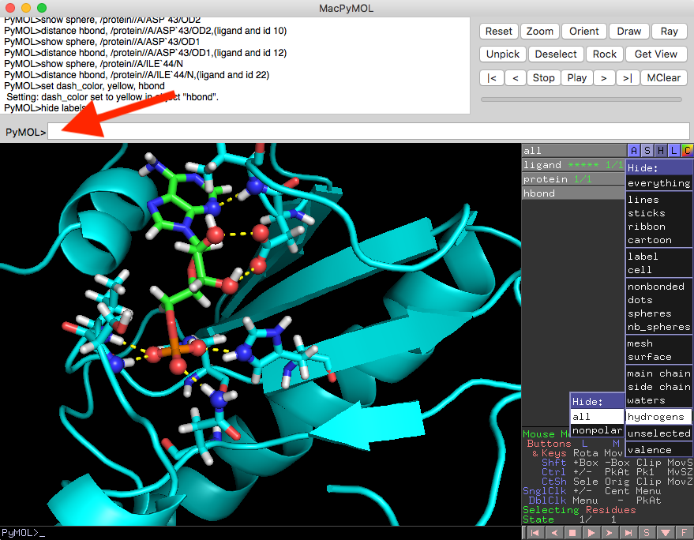

## User Guide

## Visualization Hydrogen Bonds in PyMOL

Visualizing H-bonds identified via Hbind is a 3-step process:

1. Generating an Hbind interaction table
2. Creating the PyMOL visualization commands via HbindViz' hbind_pymol_cmds.py Python script
3. Executing the generated PyMOL commands to visualize hydrogen-bonds in PyMOL

### Step 1: Generating an Hbind interaction table

First, an Hbind interaction table that lists the hydrogen bond interactions between a protein and its ligand has to be generated. The Hbind open source software is available at [https://github.com/psa-lab/Hbind](https://github.com/psa-lab/Hbind).

Once you have it installed, you can execute the following command based on the two example files provided in the [`./example_files`](example_files) subdirectory (the structure of an [PKCI-substrate analog](https://www.rcsb.org/pdb/explore.do?structureId=1kpf) with its ligand, adenosine monophsophate):

    hbind -p ./example_files/1KPF.pdb -l ./example_files/1KPF_AMP.mol2 

After executing the command above, you should see the following output in your terminal:

```
HBIND Version: 1.0.0

Documentation: http://psa-lab.github.io/hbind
Raschka, Wolf, Bemister-Buffington, Kuhn (2018)
Protein Structure and Analysis Lab, MSU (http://kuhnlab.bmb.msu.edu)

Ligand file: /Users/sebastian/code/hbind/example_files/1KPF_AMP.mol2
Protein file: /Users/sebastian/code/hbind/example_files/1KPF.pdb

++++++++++++++++++++++++++++++++ HBind Interaction Table ++++++++++++++++++++++++++++++++
#            | Ligand Atom -- Protein  Atom | Bond   D-H-A  Ligand-Protein
#            |  #  TYPE    -- RES  CH_ID  RES_NO  A_TYPE | DIST.  ANGLE  INTERACTION
| hbond     1   2  O.2     -- ASN  A       99     ND2      2.911  174.0  Acceptor - Donor
| hbond     2   3  O.3     -- SER  A      107     N        2.802  166.8  Acceptor - Donor
| hbond     3   3  O.3     -- VAL  A      108     N        3.031  178.8  Acceptor - Donor
| hbond     4   4  O.3     -- HIS  A      112     NE2      2.593  163.1  Acceptor - Donor
| hbond     5   4  O.3     -- HIS  A      114     NE2      2.581  140.4  Acceptor - Donor
| hbond     6  10  O.3     -- ASP  A       43     OD2      2.714  167.1  Donor - Acceptor
| hbond     7  12  O.3     -- ASP  A       43     OD1      2.607  154.1  Donor - Acceptor
| hbond     8  22  N.ar    -- ILE  A       44     N        3.156  154.9  Acceptor - Donor
```

Save this output to a simple text file (an example is available at `./example_files/hbind_output.txt`)


### Step 2: Creating the PyMOL visualization commands via HbindViz' hbind_pymol_cmds.py Python script


*No installation is required to run the `hbind_pymol_cmds.py` Python script included in this directory. ([Python 3.6](https://www.python.org/downloads/release/python-360/) or greater is recommended.)*


Once you have generated the Hbind interaction table (an example is available at `./example_files/hbind_output.txt`), you can execute the following command to generate the PyMOL commands for visualizing the protein-ligand hydrogen-bond interaction network:

    python code/hbind_pymol_cmds.py example_files/hbind_output.txt

The execution of the previous command should return the following output in your terminal:

```
hide lines
show cartoon
show sticks, ligand
set sphere_scale=0.32
show sticks, (protein and chain A and resi 43)
show sticks, (protein and chain A and resi 44)
show sticks, (protein and chain A and resi 112)
show sticks, (protein and chain A and resi 114)
show sticks, (protein and chain A and resi 99)
show sticks, (protein and chain A and resi 108)
show sticks, (protein and chain A and resi 107)
show sphere, (ligand and id 22)
show sphere, (ligand and id 10)
show sphere, (ligand and id 4)
show sphere, (ligand and id 12)
show sphere, (ligand and id 3)
show sphere, (ligand and id 2)
show sphere, /protein//A/ASN`99/ND2
distance hbond, /protein//A/ASN`99/ND2,(ligand and id 2)
show sphere, /protein//A/SER`107/N
distance hbond, /protein//A/SER`107/N,(ligand and id 3)
show sphere, /protein//A/VAL`108/N
distance hbond, /protein//A/VAL`108/N,(ligand and id 3)
show sphere, /protein//A/HIS`112/NE2
distance hbond, /protein//A/HIS`112/NE2,(ligand and id 4)
show sphere, /protein//A/HIS`114/NE2
distance hbond, /protein//A/HIS`114/NE2,(ligand and id 4)
show sphere, /protein//A/ASP`43/OD2
distance hbond, /protein//A/ASP`43/OD2,(ligand and id 10)
show sphere, /protein//A/ASP`43/OD1
distance hbond, /protein//A/ASP`43/OD1,(ligand and id 12)
show sphere, /protein//A/ILE`44/N
distance hbond, /protein//A/ILE`44/N,(ligand and id 22)
set dash_color, yellow, hbond
hide labels
```

---

**Tip:** 

If you are using a Linux/Unix terminal, you can redirect the outputs from Hbind or `hbind_pymol_cmds.py` to text files so that you don't need to copy it manually from the terminal. For example, the command for the redirect to `my_output.txt` would be as follows:

    python code/hbind_pymol_cmds.py example_files/hbind_output.txt > my_output.txt

---


### Step 3: Executing the generated PyMOL commands to visualize hydrogen-bonds in PyMOL

After obtaining the commands for creating the H-bond visualization in PyMOL (see Step 2), open the protein and ligand structures in PyMOL:




Next, rename the protein structure (here: "1KPF") to "protein" and the ligand structure (here: "1KPF_AMP") to "ligand" as shown in the screenshot below:



Finally, copy and paste the commands from Step 2 into the PyMOL command prompt and hit enter to see the hydrogen bonds visualized:



(Note that the Hbind table only lists the heavy atoms that participate in hydrogen bond interactions; thus, hydrogen positions are ignored in the HbondViz script, and you may want to hide these in PyMOL.)